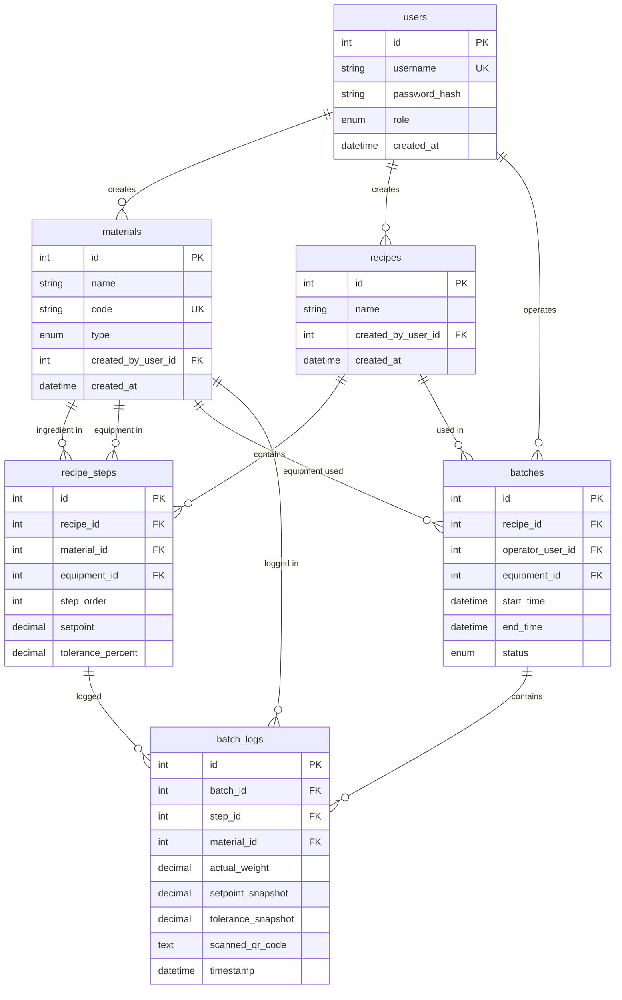
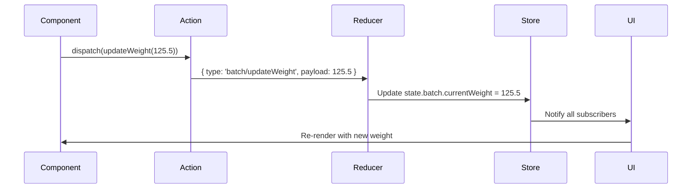
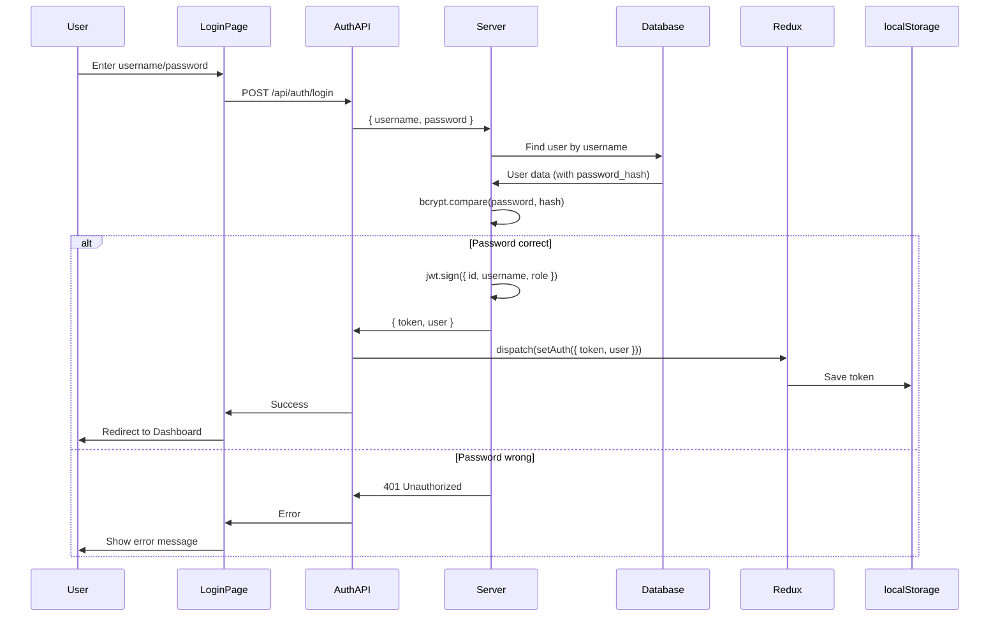
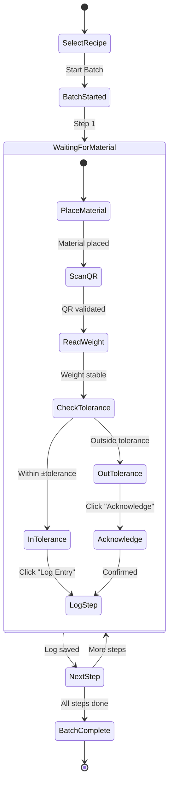
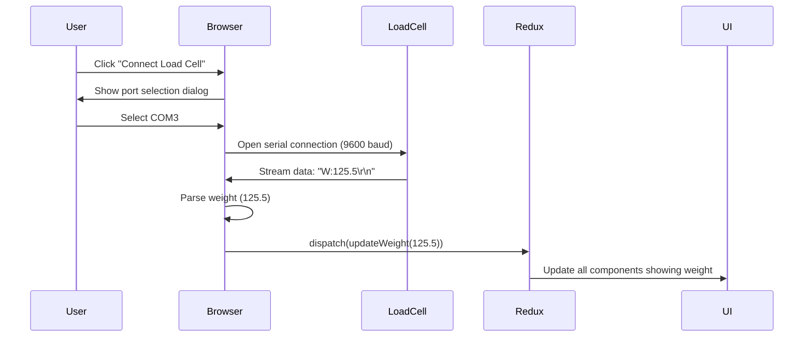
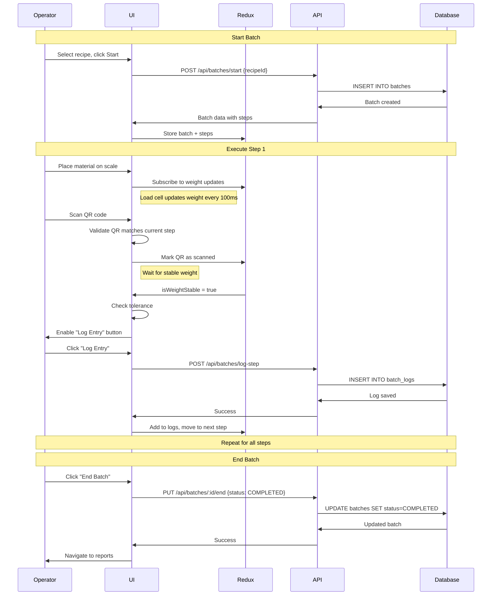
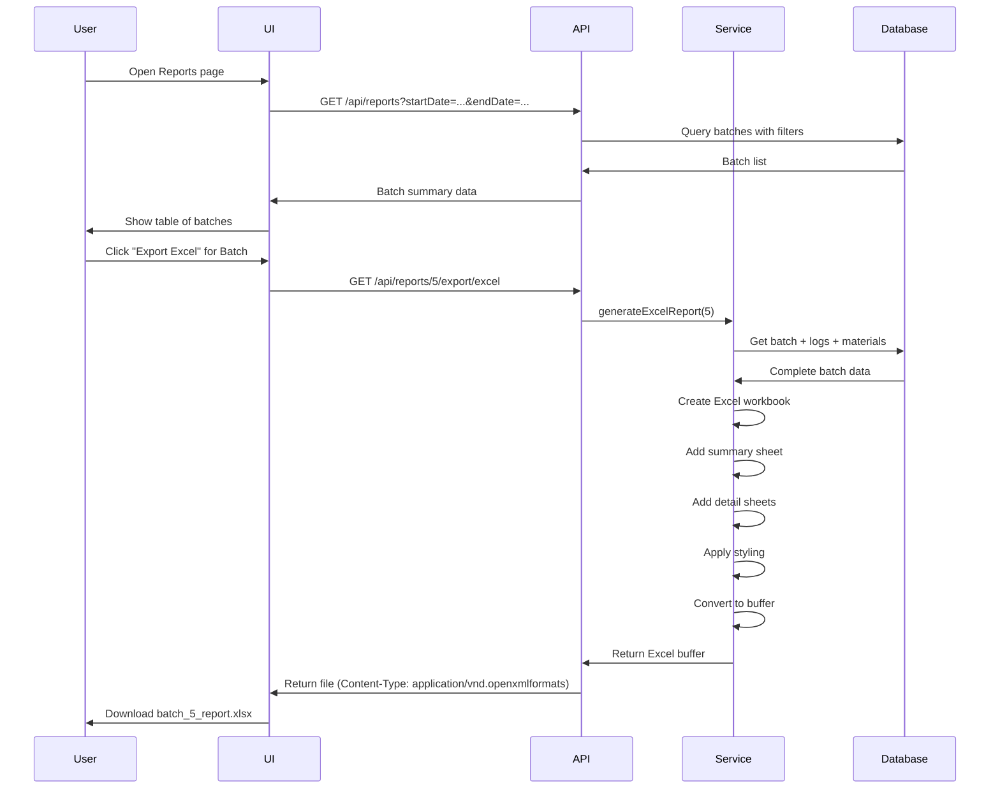

# MixSense - Complete Technical Documentation

> **Target Audience**: Developers with 1+ year of JavaScript experience
>
> **Purpose**: Understand the complete architecture, technology choices, and implementation details

---

## Table of Contents

1. [Technology Stack](#1-technology-stack)
2. [Architecture Overview](#2-architecture-overview)
3. [Database Design](#3-database-design)
4. [Backend Deep Dive](#4-backend-deep-dive)
5. [Frontend Deep Dive](#5-frontend-deep-dive)
6. [Authentication Flow](#6-authentication-flow)
7. [Key Features Implementation](#7-key-features-implementation)
8. [Advanced Patterns & Tricks](#8-advanced-patterns--tricks)
9. [Hardware Integration](#9-hardware-integration)
10. [API Request Flows](#10-api-request-flows)

---

## 1. Technology Stack

### Backend Technologies

#### **Node.js**
- **What**: JavaScript runtime built on Chrome's V8 engine
- **Why Generally Great**:
  - Non-blocking I/O (handles many requests efficiently)
  - Same language as frontend (JavaScript/TypeScript)
  - Huge ecosystem (npm packages)
- **Why We Use It**:
  - Perfect for I/O-heavy operations (database queries, API calls)
  - Easy to find developers who know JavaScript
  - Real-time capabilities for load cell data streaming

#### **TypeScript**
- **What**: JavaScript with static type checking
- **Why Generally Great**:
  - Catches bugs before runtime (type safety)
  - Better IDE autocomplete and refactoring
  - Makes large codebases maintainable
- **Why We Use It**:
  - Prevents data type errors in batch calculations (critical for weight measurements)
  - Self-documenting code (types explain what data looks like)
  - Easier refactoring as project grows

```typescript
// Example: TypeScript catches this error before runtime
interface BatchLog {
  actualWeight: number;  // Must be number
  setpoint: number;
}

const log: BatchLog = {
  actualWeight: "123",  // ❌ TypeScript Error: string not assignable to number
  setpoint: 100
};
```

#### **Express.js**
- **What**: Minimal web framework for Node.js
- **Why Generally Great**:
  - Battle-tested (used by millions)
  - Middleware system (plug-and-play features)
  - Simple and unopinionated
- **Why We Use It**:
  - Easy to structure REST API endpoints
  - Great middleware ecosystem (auth, logging, validation)
  - Fast to develop with

#### **Prisma ORM**
- **What**: Modern database toolkit (replaces raw SQL queries)
- **Why Generally Great**:
  - Type-safe database queries
  - Auto-generated client based on schema
  - Built-in migrations
  - Works with multiple databases
- **Why We Use It**:
  - Prevents SQL injection attacks automatically
  - Schema-first approach (database structure in one file)
  - Autocomplete for database queries

```typescript
// Without Prisma (raw SQL - error prone)
const batches = await db.query("SELECT * FROM batches WHERE status = ?", [status]);

// With Prisma (type-safe, autocomplete works)
const batches = await prisma.batch.findMany({
  where: { status: 'COMPLETED' },  // ✅ TypeScript knows 'status' exists
  include: { recipe: true }        // ✅ Autocomplete suggests 'recipe'
});
```

#### **MySQL**
- **What**: Relational database management system
- **Why Generally Great**:
  - ACID compliance (data integrity)
  - Proven reliability
  - Great for structured data
- **Why We Use It**:
  - Batch data has clear relationships (recipe → steps → logs)
  - Need transactions (batch logging must be atomic)
  - Strong data consistency requirements

#### **JWT (JSON Web Tokens)**
- **What**: Secure way to transmit authentication data
- **Why Generally Great**:
  - Stateless (server doesn't store sessions)
  - Contains user info (no database lookup needed)
  - Industry standard
- **Why We Use It**:
  - Simple authentication
  - Easy to verify on every request
  - Works across different domains

#### **bcrypt**
- **What**: Password hashing library
- **Why Generally Great**:
  - Slow by design (prevents brute force)
  - Auto-salting (prevents rainbow table attacks)
  - Adaptive (can increase difficulty over time)
- **Why We Use It**:
  - Never store plain passwords
  - Industry standard for password security

### Frontend Technologies

#### **React 18**
- **What**: UI library for building component-based interfaces
- **Why Generally Great**:
  - Component reusability
  - Virtual DOM (efficient updates)
  - Huge ecosystem
  - Declarative (describe UI, React handles updates)
- **Why We Use It**:
  - Perfect for complex UIs (batch execution screen)
  - Real-time updates (load cell weight display)
  - Component-based = easier maintenance

#### **Vite**
- **What**: Next-generation build tool
- **Why Generally Great**:
  - Lightning-fast hot module replacement (HMR)
  - ES modules native support
  - Much faster than Webpack
- **Why We Use It**:
  - Instant server start (no waiting)
  - Fast builds for production
  - Better developer experience

#### **Redux Toolkit**
- **What**: State management library
- **Why Generally Great**:
  - Centralized state (single source of truth)
  - Predictable state updates
  - Time-travel debugging
- **Why We Use It**:
  - Batch execution needs shared state (current step, weight, logs)
  - Authentication state needed across app
  - Simplifies complex state logic

```typescript
// Without Redux: Prop drilling nightmare
<App>
  <Header user={user} /> {/* Pass down */}
  <Sidebar user={user} /> {/* Pass down */}
  <Main>
    <Profile user={user} /> {/* Finally use it */}
  </Main>
</App>

// With Redux: Access state anywhere
const user = useSelector(state => state.auth.user); // ✅ Direct access
```

#### **TailwindCSS**
- **What**: Utility-first CSS framework
- **Why Generally Great**:
  - No naming CSS classes (use utilities)
  - Fast styling (no context switching)
  - Purges unused CSS (tiny bundle)
- **Why We Use It**:
  - Rapid UI development
  - Consistent design system
  - Responsive design made easy

```tsx
// Traditional CSS (separate file, naming hell)
<button className="primary-button large-button blue-button">Click</button>

// Tailwind (inline, clear, no new names)
<button className="bg-blue-500 px-6 py-3 text-lg rounded hover:bg-blue-600">
  Click
</button>
```

#### **Axios**
- **What**: HTTP client for making API requests
- **Why Generally Great**:
  - Better than fetch (automatic JSON parsing)
  - Interceptors (add auth headers globally)
  - Request/response transformation
- **Why We Use It**:
  - Easy to add JWT token to all requests
  - Better error handling
  - Request cancellation support

#### **Web Serial API**
- **What**: Browser API to communicate with serial devices
- **Why We Use It**:
  - Direct load cell integration (no extra backend needed)
  - Real-time weight reading
  - Chrome/Edge native support

---

## 2. Architecture Overview

### High-Level Architecture

```
┌─────────────────────────────────────────────────────────────┐
│                        BROWSER                              │
│  ┌──────────────────────────────────────────────────────┐  │
│  │           React App (SPA)                            │  │
│  │  ┌────────────┐  ┌─────────────┐  ┌──────────────┐  │  │
│  │  │  Components│  │ Redux Store │  │  Web Serial  │  │  │
│  │  │   (UI)     │←→│   (State)   │  │  (Hardware)  │  │  │
│  │  └────────────┘  └─────────────┘  └──────────────┘  │  │
│  │         ↓ Axios                                      │  │
│  └─────────|───────────────────────────────────────────┘  │
└────────────|──────────────────────────────────────────────┘
             │ HTTP/JSON (REST API)
             ↓
┌─────────────────────────────────────────────────────────────┐
│                    SERVER (Node.js)                         │
│  ┌──────────────────────────────────────────────────────┐  │
│  │              Express App                             │  │
│  │  ┌──────────┐  ┌──────────┐  ┌──────────────────┐   │  │
│  │  │ Routes   │→ │Controllers│→│    Services      │   │  │
│  │  │ (URLs)   │  │ (Handlers)│  │ (Business Logic) │   │  │
│  │  └──────────┘  └──────────┘  └────────┬─────────┘   │  │
│  │                                        ↓             │  │
│  │                                  ┌──────────┐       │  │
│  │                                  │  Prisma  │       │  │
│  │                                  │  (ORM)   │       │  │
│  │                                  └────┬─────┘       │  │
│  └───────────────────────────────────────|─────────────┘  │
└──────────────────────────────────────────|────────────────┘
                                           │ SQL Queries
                                           ↓
                              ┌────────────────────────┐
                              │    MySQL Database      │
                              │  ┌──────────────────┐  │
                              │  │  Tables:         │  │
                              │  │  • users         │  │
                              │  │  • materials     │  │
                              │  │  • recipes       │  │
                              │  │  • batches       │  │
                              │  │  • batch_logs    │  │
                              │  └──────────────────┘  │
                              └────────────────────────┘
```

### Request Flow Pattern

All API requests follow this pattern:

```
Client Request
     ↓
[1] Route (URLs mapping)
     ↓
[2] Middleware Chain
     ├─→ CORS Check
     ├─→ JSON Parser
     ├─→ JWT Verification (auth required routes)
     ├─→ Role Check (admin/operator)
     └─→ Request Validation
     ↓
[3] Controller (handles HTTP)
     ├─→ Extract request data
     ├─→ Call service method
     └─→ Return JSON response
     ↓
[4] Service (business logic)
     ├─→ Validate business rules
     ├─→ Database operations (via Prisma)
     └─→ Return data
     ↓
[5] Response sent to client
```

### Folder Structure Logic

```
server/
├── src/
│   ├── config/          # Configuration (env, database, JWT)
│   ├── middleware/      # Reusable request processors
│   ├── modules/         # Feature-based modules (auth, batches, etc.)
│   │   └── batches/
│   │       ├── batches.routes.ts      # [1] URLs
│   │       ├── batches.controller.ts  # [2] HTTP handlers
│   │       └── batches.service.ts     # [3] Business logic
│   ├── types/           # TypeScript type definitions
│   ├── utils/           # Helpers (logger, validators)
│   ├── app.ts           # Express app setup
│   └── server.ts        # Entry point
└── prisma/
    └── schema.prisma    # Database schema
```

**Why this structure?**
- **Separation of Concerns**: Routes don't know about database, services don't know about HTTP
- **Testability**: Can test services without HTTP
- **Reusability**: Services can be called from multiple routes
- **Scalability**: Easy to add new features (just add new module)

---

## 3. Database Design

### Entity Relationship Diagram



### Why This Schema Design?

#### **1. Snapshot Pattern (Critical Decision)**

Notice `batch_logs` has `setpoint_snapshot` and `tolerance_snapshot`:

```sql
batch_logs
  ├── setpoint_snapshot      ← Copied from recipe_step.setpoint
  └── tolerance_snapshot     ← Copied from recipe_step.tolerance_percent
```

**Why not just reference recipe_step values?**

```typescript
// ❌ BAD: What if recipe is edited later?
const log = await prisma.batchLog.findUnique({
  include: { step: true }
});
console.log(log.step.setpoint); // This might be DIFFERENT now!

// ✅ GOOD: Snapshot preserves historical data
console.log(log.setpointSnapshot); // This is what it was AT THE TIME
```

**Real-world scenario**:
1. Day 1: Recipe says "Add 100g of Sugar"
2. Day 1: Batch executed, log saved with `setpoint_snapshot = 100`
3. Day 5: Recipe updated to "Add 150g of Sugar"
4. Day 10: View old batch report
   - Without snapshot: Shows 150g (WRONG! Recipe changed)
   - With snapshot: Shows 100g (CORRECT! What actually happened)

#### **2. Material Type Enum**

```prisma
enum MaterialType {
  INGREDIENT  // Things you mix (flour, sugar)
  EQUIPMENT   // Things you use (mixer, scale)
}
```

**Why one table instead of two?**
- Both have same fields (name, code)
- Simplifies queries (one join instead of two)
- Easier to manage (one CRUD interface)

#### **3. Soft Delete vs Hard Delete**

We DON'T soft delete because:
- Materials/Recipes can't be deleted if used (checked in service layer)
- Batches are permanent records (never deleted)
- Keeps database clean

---

## 4. Backend Deep Dive

### Module Architecture Pattern

Every module follows the same 3-layer pattern:

```
┌─────────────────────────────────────────────────┐
│  batches.routes.ts (Layer 1: HTTP Routing)      │
├─────────────────────────────────────────────────┤
│  • Maps URLs to controller methods             │
│  • Applies middleware (auth, validation)        │
│  • NO business logic                            │
└─────────────────────────────────────────────────┘
                    ↓
┌─────────────────────────────────────────────────┐
│  batches.controller.ts (Layer 2: HTTP Handling) │
├─────────────────────────────────────────────────┤
│  • Extracts data from req.body/req.params       │
│  • Calls service methods                        │
│  • Returns JSON responses                       │
│  • Handles HTTP errors (400, 404, 500)          │
│  • NO database access                           │
└─────────────────────────────────────────────────┘
                    ↓
┌─────────────────────────────────────────────────┐
│  batches.service.ts (Layer 3: Business Logic)   │
├─────────────────────────────────────────────────┤
│  • Validates business rules                     │
│  • Database operations (Prisma)                 │
│  • Complex calculations                         │
│  • NO HTTP knowledge (no req/res)               │
└─────────────────────────────────────────────────┘
```

### Example: Start Batch Flow

```typescript
// ============= LAYER 1: ROUTES =============
// batches.routes.ts
router.post(
  '/start',
  authenticateToken,           // Middleware: Verify JWT
  requireRole(['OPERATOR']),   // Middleware: Check role
  batchController.startBatch   // Handler
);

// ============= LAYER 2: CONTROLLER =============
// batches.controller.ts
async startBatch(req: Request, res: Response) {
  try {
    const { recipeId, equipmentId } = req.body;
    const operatorId = req.user!.id; // From JWT middleware

    // Call service (business logic)
    const batch = await batchService.startBatch({
      recipeId,
      operatorId,
      equipmentId
    });

    // Return HTTP response
    res.status(201).json({
      success: true,
      data: batch
    });
  } catch (error) {
    // HTTP error handling
    res.status(400).json({
      success: false,
      message: error.message
    });
  }
}

// ============= LAYER 3: SERVICE =============
// batches.service.ts
async startBatch(data: StartBatchData) {
  // Business rule: Recipe must exist
  const recipe = await prisma.recipe.findUnique({
    where: { id: data.recipeId },
    include: { steps: true }
  });

  if (!recipe) {
    throw new Error('Recipe not found');
  }

  // Business rule: Recipe must have steps
  if (recipe.steps.length === 0) {
    throw new Error('Recipe has no steps');
  }

  // Business rule: Equipment must be valid type
  if (data.equipmentId) {
    const equipment = await prisma.material.findFirst({
      where: {
        id: data.equipmentId,
        type: 'EQUIPMENT'  // Must be equipment type
      }
    });

    if (!equipment) {
      throw new Error('Invalid equipment');
    }
  }

  // Create batch
  return await prisma.batch.create({
    data: {
      recipeId: data.recipeId,
      operatorUserId: data.operatorId,
      equipmentId: data.equipmentId,
      startTime: new Date(),
      status: 'IN_PROGRESS'
    },
    include: {
      recipe: { include: { steps: true } },
      operator: true,
      equipment: true
    }
  });
}
```

**Why 3 layers?**
- **Testability**: Can test service without mocking HTTP
- **Reusability**: Service can be called from WebSocket, CLI, etc.
- **Clarity**: Each file has ONE job

### Middleware Chain Pattern

```typescript
// Middleware is like a security checkpoint at an airport

Request comes in
     ↓
[1] CORS Middleware
     │ Check: Is request from allowed domain?
     │ ✅ Yes → continue
     │ ❌ No → block (403 error)
     ↓
[2] JSON Parser Middleware
     │ Parse: Convert JSON string to JavaScript object
     │ Now req.body is available
     ↓
[3] Auth Middleware (authenticateToken)
     │ Check: Is JWT token valid?
     │ ✅ Yes → attach user to req.user, continue
     │ ❌ No → block (401 error)
     ↓
[4] Role Middleware (requireRole)
     │ Check: Does user have required role?
     │ ✅ Yes → continue
     │ ❌ No → block (403 error)
     ↓
[5] Validation Middleware
     │ Check: Is request data valid?
     │ ✅ Yes → continue
     │ ❌ No → block (400 error)
     ↓
[6] Controller (your code runs)
```

**Implementation**:

```typescript
// middleware/auth.ts
export function authenticateToken(req: Request, res: Response, next: NextFunction) {
  const token = req.headers.authorization?.split(' ')[1]; // "Bearer TOKEN"

  if (!token) {
    return res.status(401).json({ message: 'No token provided' });
  }

  try {
    const decoded = jwt.verify(token, env.JWT_SECRET);
    req.user = decoded; // Attach user info to request
    next(); // ✅ Pass to next middleware
  } catch (error) {
    return res.status(401).json({ message: 'Invalid token' });
  }
}

// middleware/roles.ts
export function requireRole(allowedRoles: Role[]) {
  return (req: Request, res: Response, next: NextFunction) => {
    if (!req.user) {
      return res.status(401).json({ message: 'Not authenticated' });
    }

    if (!allowedRoles.includes(req.user.role)) {
      return res.status(403).json({ message: 'Insufficient permissions' });
    }

    next(); // ✅ Pass to controller
  };
}
```

### Prisma Query Patterns

#### **Pattern 1: Include (JOIN in SQL)**

```typescript
// Get batch WITH related data
const batch = await prisma.batch.findUnique({
  where: { id: 1 },
  include: {
    recipe: true,      // JOIN recipes
    operator: true,    // JOIN users
    logs: {            // JOIN batch_logs
      include: {
        material: true // NESTED JOIN materials
      }
    }
  }
});

// Result structure:
{
  id: 1,
  recipeId: 5,
  recipe: { id: 5, name: "Chocolate Cake" },  // ← Included
  operator: { id: 2, username: "john" },       // ← Included
  logs: [                                      // ← Included
    {
      id: 10,
      materialId: 3,
      material: { id: 3, name: "Sugar" }       // ← Nested include
    }
  ]
}
```

#### **Pattern 2: Select (Choose specific fields)**

```typescript
// Only get specific fields (saves bandwidth)
const users = await prisma.user.findMany({
  select: {
    id: true,
    username: true,
    // password_hash NOT selected (security!)
  }
});
```

#### **Pattern 3: Transactions (All or nothing)**

```typescript
// Update recipe: Delete old steps, create new ones
// If ANY step fails, EVERYTHING rolls back
const recipe = await prisma.$transaction(async (tx) => {
  // Delete old steps
  await tx.recipeStep.deleteMany({
    where: { recipeId: 1 }
  });

  // Create new steps
  await tx.recipeStep.createMany({
    data: newSteps
  });

  // Get updated recipe
  return await tx.recipe.findUnique({
    where: { id: 1 },
    include: { steps: true }
  });
});
```

**Why transactions?**
```typescript
// ❌ WITHOUT transaction:
await deleteOldSteps();  // ✅ Success
await createNewSteps();  // ❌ Fails (database crash)
// Result: Recipe has NO steps! (data loss)

// ✅ WITH transaction:
await transaction(() => {
  deleteOldSteps();  // ✅ Success
  createNewSteps();  // ❌ Fails
  // Transaction ROLLS BACK, old steps restored!
});
```

---

## 5. Frontend Deep Dive

### Component Hierarchy

```
App.tsx
├── Router
│   ├── LoginPage
│   └── AppLayout (after login)
│       ├── Header
│       │   ├── Logo
│       │   ├── Clock (real-time)
│       │   └── UserMenu
│       ├── Sidebar
│       │   └── Navigation Links
│       └── Main Content
│           ├── DashboardPage
│           │   ├── StatsCard (active batches)
│           │   ├── EquipmentStatusCard
│           │   └── RecentBatches
│           ├── MaterialsPage (Admin only)
│           │   ├── MaterialForm
│           │   └── MaterialGrid
│           ├── RecipesPage (Admin only)
│           │   ├── RecipeBuilder
│           │   │   ├── RecipeInfo
│           │   │   └── StepsGrid
│           │   └── RecipeList
│           ├── RunBatchPage (Operator)
│           │   ├── BatchInfo
│           │   ├── ActiveStepView
│           │   │   ├── WeightDisplay (from Redux)
│           │   │   └── ToleranceIndicator
│           │   ├── StepListPanel
│           │   ├── QrScanSection
│           │   │   └── QrInput (keyboard listener)
│           │   └── HistoryTable
│           └── ReportsPage
│               ├── ReportFilters
│               ├── BatchTable
│               └── ExportButtons
```

### Redux State Management

#### **Why Redux for This Project?**

```typescript
// Problem: Load cell weight needs to be accessed everywhere
<RunBatchPage>
  <WeightDisplay />        {/* Needs weight */}
  <ToleranceIndicator />   {/* Needs weight */}
  <QrSection />            {/* Needs weight */}
  <StepPanel />            {/* Needs weight */}
</RunBatchPage>

// ❌ Without Redux: Pass props through EVERY component (prop drilling)
<RunBatchPage weight={weight} onWeightChange={setWeight}>
  <Container weight={weight}>      {/* Just passing through */}
    <Panel weight={weight}>         {/* Just passing through */}
      <WeightDisplay weight={weight} /> {/* Finally use it! */}
    </Panel>
  </Container>
</RunBatchPage>

// ✅ With Redux: Any component can access directly
function WeightDisplay() {
  const weight = useSelector(state => state.batch.currentWeight);
  return <div>{weight}g</div>;
}
```

#### **Store Structure**

```typescript
// store/index.ts
{
  auth: {
    user: { id: 1, username: "john", role: "OPERATOR" },
    token: "eyJhbGc...",
    isAuthenticated: true
  },

  batch: {
    activeBatch: { id: 5, recipeId: 2, ... },
    currentStep: 3,
    currentWeight: 125.5,      // From load cell
    isWeightStable: true,
    logs: [
      { stepId: 1, actualWeight: 100.2, ... },
      { stepId: 2, actualWeight: 50.5, ... }
    ]
  },

  ui: {
    showModal: false,
    toastMessage: null,
    isLoading: false
  }
}
```

#### **Redux Flow Diagram**



**Code Example**:

```typescript
// store/batchSlice.ts
const batchSlice = createSlice({
  name: 'batch',
  initialState: {
    currentWeight: 0,
    isWeightStable: false
  },
  reducers: {
    updateWeight: (state, action) => {
      state.currentWeight = action.payload;
      // Calculate stability (if weight hasn't changed much)
      state.isWeightStable = Math.abs(state.currentWeight - state.previousWeight) < 0.5;
    }
  }
});

// Component
function WeightDisplay() {
  const weight = useSelector(state => state.batch.currentWeight);
  const isStable = useSelector(state => state.batch.isWeightStable);

  return (
    <div className={isStable ? 'text-green-500' : 'text-yellow-500'}>
      {weight.toFixed(2)}g
      {isStable && <span>✓ STABLE</span>}
    </div>
  );
}
```

### Custom Hooks Pattern

Custom hooks encapsulate reusable logic:

#### **useLoadCell Hook**

```typescript
// hooks/useLoadCell.ts
export function useLoadCell() {
  const dispatch = useDispatch();
  const [port, setPort] = useState<SerialPort | null>(null);
  const [isConnected, setIsConnected] = useState(false);

  // Connect to load cell
  const connect = async () => {
    try {
      // Request serial port from user
      const selectedPort = await navigator.serial.requestPort();
      await selectedPort.open({ baudRate: 9600 });

      setPort(selectedPort);
      setIsConnected(true);

      // Start reading data
      readData(selectedPort);
    } catch (error) {
      console.error('Failed to connect:', error);
    }
  };

  // Read data from serial port
  const readData = async (port: SerialPort) => {
    const reader = port.readable.getReader();

    while (true) {
      const { value, done } = await reader.read();
      if (done) break;

      // Parse weight from serial data
      const text = new TextDecoder().decode(value);
      const weight = parseWeight(text); // e.g., "Weight: 125.5g" → 125.5

      // Update Redux store
      dispatch(updateWeight(weight));
    }
  };

  return { connect, isConnected };
}

// Usage in component
function LoadCellButton() {
  const { connect, isConnected } = useLoadCell();

  return (
    <button onClick={connect}>
      {isConnected ? 'Connected ✓' : 'Connect Load Cell'}
    </button>
  );
}
```

**Why custom hook?**
- Reusable across components
- Separates logic from UI
- Testable independently

---

## 6. Authentication Flow

### Complete Auth Flow Diagram



### Implementation Details

#### **Backend: Login**

```typescript
// modules/auth/auth.service.ts
async login(username: string, password: string) {
  // 1. Find user
  const user = await prisma.user.findUnique({
    where: { username }
  });

  if (!user) {
    throw new Error('Invalid credentials'); // Don't reveal which part is wrong!
  }

  // 2. Verify password
  const isValid = await bcrypt.compare(password, user.password_hash);

  if (!isValid) {
    throw new Error('Invalid credentials');
  }

  // 3. Generate JWT
  const token = jwt.sign(
    {
      id: user.id,
      username: user.username,
      role: user.role
    },
    env.JWT_SECRET,
    { expiresIn: '8h' }
  );

  // 4. Return token (don't send password_hash!)
  return {
    token,
    user: {
      id: user.id,
      username: user.username,
      role: user.role
    }
  };
}
```

#### **Frontend: Login**

```typescript
// components/auth/LoginPage.tsx
function LoginPage() {
  const dispatch = useDispatch();
  const navigate = useNavigate();

  const handleSubmit = async (e: FormEvent) => {
    e.preventDefault();

    try {
      // Call API
      const response = await axios.post('/api/auth/login', {
        username,
        password
      });

      // Save to Redux + localStorage
      dispatch(setAuth({
        token: response.data.token,
        user: response.data.user
      }));

      localStorage.setItem('token', response.data.token);

      // Redirect
      navigate('/dashboard');
    } catch (error) {
      setError('Invalid username or password');
    }
  };

  return <form onSubmit={handleSubmit}>...</form>;
}
```

#### **Axios Interceptor (Auto-attach token)**

```typescript
// api/http.ts
const api = axios.create({
  baseURL: import.meta.env.VITE_API_URL
});

// Add token to EVERY request automatically
api.interceptors.request.use((config) => {
  const token = localStorage.getItem('token');
  if (token) {
    config.headers.Authorization = `Bearer ${token}`;
  }
  return config;
});

// Handle 401 errors (token expired)
api.interceptors.response.use(
  (response) => response,
  (error) => {
    if (error.response?.status === 401) {
      // Token expired, logout
      localStorage.removeItem('token');
      window.location.href = '/login';
    }
    return Promise.reject(error);
  }
);
```

**Why interceptors?**
```typescript
// ❌ Without interceptor (repeat token in EVERY call)
axios.get('/api/batches', {
  headers: { Authorization: `Bearer ${token}` }
});
axios.post('/api/batches', data, {
  headers: { Authorization: `Bearer ${token}` }
});

// ✅ With interceptor (automatic!)
api.get('/api/batches');      // Token added automatically
api.post('/api/batches', data); // Token added automatically
```

---

## 7. Key Features Implementation

### Feature 1: Batch Execution (Most Complex)

#### **Flow Diagram**



#### **Implementation: Tolerance Calculation**

```typescript
// The tolerance logic is CRITICAL for safety

interface ToleranceCheck {
  setpoint: number;        // Target weight (e.g., 100g)
  actual: number;          // Measured weight (e.g., 98g)
  tolerance: number;       // Allowed variance (e.g., 5%)
}

function checkTolerance({ setpoint, actual, tolerance }: ToleranceCheck) {
  // Calculate tolerance range
  // If tolerance is 5% and setpoint is 100g:
  //   range = 100 * 0.05 = 5g
  const toleranceRange = setpoint * (tolerance / 100);

  // Calculate bounds
  //   lowerBound = 100 - 5 = 95g
  //   upperBound = 100 + 5 = 105g
  const lowerBound = setpoint - toleranceRange;
  const upperBound = setpoint + toleranceRange;

  // Check if actual weight is within bounds
  const isWithinTolerance = actual >= lowerBound && actual <= upperBound;

  // Calculate how far off we are (for display)
  const deviation = Math.abs(actual - setpoint);
  const deviationPercent = (deviation / setpoint) * 100;

  return {
    isWithinTolerance,
    lowerBound,
    upperBound,
    deviation,
    deviationPercent
  };
}

// Example usage:
const result = checkTolerance({
  setpoint: 100,
  actual: 98,
  tolerance: 5
});

console.log(result);
// {
//   isWithinTolerance: true,    // ✅ 98 is between 95-105
//   lowerBound: 95,
//   upperBound: 105,
//   deviation: 2,
//   deviationPercent: 2         // 2% off
// }
```

#### **Component: Active Step View**

```typescript
function ActiveStepView() {
  // Get current state from Redux
  const currentStep = useSelector(state => state.batch.currentStep);
  const currentWeight = useSelector(state => state.batch.currentWeight);
  const isStable = useSelector(state => state.batch.isWeightStable);
  const recipe = useSelector(state => state.batch.activeBatch?.recipe);

  // Get current step details
  const step = recipe?.steps[currentStep];

  if (!step) return <div>No active step</div>;

  // Check tolerance
  const tolerance = checkTolerance({
    setpoint: step.setpoint,
    actual: currentWeight,
    tolerance: step.tolerancePercent
  });

  // Determine color based on tolerance
  const weightColor = tolerance.isWithinTolerance
    ? 'text-green-500'   // ✅ Within tolerance
    : 'text-red-500';    // ❌ Outside tolerance

  return (
    <div className="p-6 bg-white rounded-lg shadow">
      <h2 className="text-2xl font-bold mb-4">
        Step {currentStep + 1}: {step.material.name}
      </h2>

      {/* Setpoint */}
      <div className="mb-4">
        <span className="text-gray-600">Target:</span>
        <span className="text-xl font-bold ml-2">
          {step.setpoint}g ± {step.tolerancePercent}%
        </span>
      </div>

      {/* Current Weight */}
      <div className="mb-4">
        <span className="text-gray-600">Current Weight:</span>
        <span className={`text-4xl font-bold ml-2 ${weightColor}`}>
          {currentWeight.toFixed(2)}g
        </span>
        {isStable && <span className="text-green-500 ml-2">✓ STABLE</span>}
      </div>

      {/* Tolerance Indicator */}
      <div className="mb-4">
        <div className="flex items-center gap-2">
          <span className="text-gray-600">Tolerance:</span>
          {tolerance.isWithinTolerance ? (
            <span className="px-3 py-1 bg-green-100 text-green-800 rounded">
              ✓ IN TOLERANCE
            </span>
          ) : (
            <span className="px-3 py-1 bg-red-100 text-red-800 rounded">
              ⚠ OUT OF TOLERANCE ({tolerance.deviationPercent.toFixed(1)}% off)
            </span>
          )}
        </div>
      </div>

      {/* Visual Range Indicator */}
      <ToleranceRangeBar
        min={tolerance.lowerBound}
        max={tolerance.upperBound}
        current={currentWeight}
        setpoint={step.setpoint}
      />
    </div>
  );
}
```

### Feature 2: QR Code Scanning

#### **QR Format Design**

```
Format: MaterialCode,Setpoint,ActualValue,MaterialName,Equipment
Example: MAT001,100.5,98.2,Sugar,Mixer-A
```

**Why this format?**
- Comma-separated = easy to parse
- Contains ALL info needed for verification
- Can be scanned without network (offline validation)

#### **Implementation**

```typescript
// hooks/useQrScanner.ts
export function useQrScanner(onScan: (data: QrData) => void) {
  const [buffer, setBuffer] = useState('');

  useEffect(() => {
    const handleKeyPress = (e: KeyboardEvent) => {
      // QR scanner acts like keyboard

      if (e.key === 'Enter') {
        // Enter = end of QR scan
        parseAndValidate(buffer);
        setBuffer(''); // Clear buffer
      } else {
        // Accumulate characters
        setBuffer(prev => prev + e.key);
      }
    };

    window.addEventListener('keydown', handleKeyPress);
    return () => window.removeEventListener('keydown', handleKeyPress);
  }, [buffer]);

  const parseAndValidate = (qrString: string) => {
    // Parse: "MAT001,100.5,98.2,Sugar,Mixer-A"
    const parts = qrString.split(',');

    if (parts.length !== 5) {
      alert('Invalid QR code format');
      return;
    }

    const qrData = {
      materialCode: parts[0],
      setpoint: parseFloat(parts[1]),
      actualValue: parseFloat(parts[2]),
      materialName: parts[3],
      equipment: parts[4]
    };

    // Validate against current step
    const currentStep = getCurrentStep(); // From Redux

    if (qrData.materialCode !== currentStep.material.code) {
      alert(`Wrong material! Expected ${currentStep.material.code}`);
      return;
    }

    // All good!
    onScan(qrData);
  };
}

// Usage
function QrScanSection() {
  const dispatch = useDispatch();

  const handleScan = (qrData: QrData) => {
    // QR validated, update state
    dispatch(setScannedQr(qrData));
  };

  useQrScanner(handleScan);

  return (
    <div>
      <input
        type="text"
        placeholder="Scan QR code..."
        className="border p-2"
        // Auto-focuses so scanner input goes here
        autoFocus
      />
    </div>
  );
}
```

### Feature 3: Report Generation (Excel/PDF)

#### **Why Two Formats?**
- **Excel**: Data analysis, import to other systems
- **PDF**: Printing, archival, signatures

#### **Excel Export Pattern**

```typescript
// reports.service.ts
async generateExcelReport(batchId: number) {
  const batch = await getBatchDetails(batchId);

  const workbook = new ExcelJS.Workbook();
  const sheet = workbook.addWorksheet('Batch Report');

  // Header row (with styling!)
  sheet.addRow(['Step', 'Material', 'Setpoint', 'Actual', 'Tolerance']);
  sheet.getRow(1).font = { bold: true };
  sheet.getRow(1).fill = {
    type: 'pattern',
    pattern: 'solid',
    fgColor: { argb: 'FF428BCA' } // Blue background
  };

  // Data rows
  batch.logs.forEach(log => {
    const row = sheet.addRow([
      log.step.stepOrder,
      log.material.name,
      log.setpointSnapshot,
      log.actualWeight,
      `±${log.toleranceSnapshot}%`
    ]);

    // Color code based on tolerance
    const isOk = isWithinTolerance(log);
    row.getCell(4).fill = {
      type: 'pattern',
      pattern: 'solid',
      fgColor: { argb: isOk ? 'FF90EE90' : 'FFFFCCCB' } // Green or red
    };
  });

  // Auto-fit columns
  sheet.columns.forEach(column => {
    column.width = 15;
  });

  // Convert to buffer
  const buffer = await workbook.xlsx.writeBuffer();
  return buffer;
}
```

**Trick: Conditional Formatting in Code**
```typescript
// We check tolerance in the service and color-code cells
// This way, users can instantly see issues when opening Excel!
```

---

## 8. Advanced Patterns & Tricks

### Trick 1: Type-Safe Express Request

```typescript
// Problem: req.user is undefined by default in Express
app.get('/profile', (req, res) => {
  const userId = req.user.id; // ❌ TypeScript error: Property 'user' does not exist
});

// Solution: Extend Express types
// types/express.ts
declare global {
  namespace Express {
    interface Request {
      user?: {
        id: number;
        username: string;
        role: 'ADMIN' | 'OPERATOR';
      };
    }
  }
}

// Now TypeScript knows about req.user!
app.get('/profile', (req, res) => {
  const userId = req.user?.id; // ✅ Works! (optional chaining needed)
});
```

### Trick 2: Prisma Decimal Handling

```typescript
// Problem: Prisma returns Decimal objects, not numbers
const log = await prisma.batchLog.findUnique({ where: { id: 1 } });
console.log(log.actualWeight); // Decimal { value: "125.5" } ← Not a number!
console.log(log.actualWeight + 10); // ❌ Error: Can't add to Decimal

// Solution: Convert to number
const weight = Number(log.actualWeight); // ✅ Now it's 125.5
console.log(weight + 10); // ✅ 135.5

// Why Prisma uses Decimal?
// - Prevents floating-point errors (0.1 + 0.2 = 0.30000000000000004)
// - For money/weight, precision matters!
```

### Trick 3: Transaction Rollback Pattern

```typescript
// Pattern: Try operation, rollback if validation fails later
async updateRecipe(id: number, data: UpdateRecipeData) {
  return await prisma.$transaction(async (tx) => {
    // Step 1: Update recipe name
    const recipe = await tx.recipe.update({
      where: { id },
      data: { name: data.name }
    });

    // Step 2: Validate steps (business logic)
    if (data.steps.length === 0) {
      throw new Error('Recipe must have at least one step');
      // ← Transaction AUTOMATICALLY rolls back!
      //   Recipe name NOT changed in database
    }

    // Step 3: Delete old steps
    await tx.recipeStep.deleteMany({
      where: { recipeId: id }
    });

    // Step 4: Create new steps
    await tx.recipeStep.createMany({
      data: data.steps.map(s => ({ ...s, recipeId: id }))
    });

    return recipe;
  });
}
```

**Why this is powerful:**
- If ANYTHING fails, EVERYTHING reverts
- Keeps data consistent
- No orphaned data

### Trick 4: Snapshot Before Delete

```typescript
// Pattern: Check usage before deleting
async deleteMaterial(id: number) {
  // Check if material is used
  const usageCount = await prisma.recipeStep.count({
    where: {
      OR: [
        { materialId: id },
        { equipmentId: id }
      ]
    }
  });

  if (usageCount > 0) {
    // Don't delete! Provide helpful error
    throw new Error(
      `Cannot delete material: used in ${usageCount} recipe step(s). ` +
      `Remove from recipes first.`
    );
  }

  // Safe to delete
  await prisma.material.delete({ where: { id } });
}
```

### Trick 5: Password Change Security

```typescript
// auth.service.ts
async changePassword(userId: number, oldPassword: string, newPassword: string) {
  // 1. Get user with password_hash
  const user = await prisma.user.findUnique({
    where: { id: userId }
  });

  if (!user) {
    throw new Error('User not found');
  }

  // 2. VERIFY old password (security!)
  const isOldPasswordCorrect = await bcrypt.compare(
    oldPassword,
    user.password_hash
  );

  if (!isOldPasswordCorrect) {
    throw new Error('Current password is incorrect');
    // ← Prevents someone who found logged-in computer from changing password
  }

  // 3. Hash new password
  const newHash = await bcrypt.hash(newPassword, 10);

  // 4. Update
  await prisma.user.update({
    where: { id: userId },
    data: { password_hash: newHash }
  });
}
```

---

## 9. Hardware Integration

### Load Cell Integration (Web Serial API)



#### **Implementation Deep Dive**

```typescript
// hooks/useLoadCell.ts
export function useLoadCell() {
  const dispatch = useDispatch();
  const [port, setPort] = useState<SerialPort | null>(null);

  const connect = async () => {
    // 1. Request port access (browser shows dialog)
    const selectedPort = await navigator.serial.requestPort({
      // Optional: Filter specific devices
      filters: [
        { usbVendorId: 0x1234 } // Your load cell vendor ID
      ]
    });

    // 2. Open connection
    await selectedPort.open({
      baudRate: 9600,      // Communication speed
      dataBits: 8,         // Standard
      stopBits: 1,         // Standard
      parity: 'none'       // No parity checking
    });

    setPort(selectedPort);

    // 3. Start reading
    readLoop(selectedPort);
  };

  const readLoop = async (port: SerialPort) => {
    const reader = port.readable!.getReader();
    const decoder = new TextDecoder();
    let buffer = '';

    try {
      while (true) {
        // Read chunk of data
        const { value, done } = await reader.read();
        if (done) break;

        // Convert bytes to text
        buffer += decoder.decode(value, { stream: true });

        // Process complete lines
        const lines = buffer.split('\n');
        buffer = lines.pop() || ''; // Keep incomplete line in buffer

        for (const line of lines) {
          processLine(line.trim());
        }
      }
    } catch (error) {
      console.error('Read error:', error);
    } finally {
      reader.releaseLock();
    }
  };

  const processLine = (line: string) => {
    // Parse different formats
    // Format 1: "W:125.5"
    // Format 2: "Weight: 125.5 kg"
    // Format 3: "  125.5  ST" (ST = stable)

    let weight: number | null = null;
    let isStable = false;

    if (line.startsWith('W:')) {
      weight = parseFloat(line.substring(2));
    } else if (line.includes('Weight:')) {
      const match = line.match(/Weight:\s*([\d.]+)/);
      weight = match ? parseFloat(match[1]) : null;
    } else {
      // Try to extract any number
      const match = line.match(/([\d.]+)/);
      weight = match ? parseFloat(match[1]) : null;
      isStable = line.includes('ST') || line.includes('STABLE');
    }

    if (weight !== null) {
      dispatch(updateWeight({ weight, isStable }));
    }
  };

  const disconnect = async () => {
    if (port) {
      await port.close();
      setPort(null);
    }
  };

  return { connect, disconnect, isConnected: !!port };
}
```

**Key Concepts:**

1. **Baud Rate (9600)**: Communication speed
   - 9600 = 9600 bits per second
   - Common for simple devices
   - Faster isn't always better (device must support it)

2. **Text Decoder**: Converts bytes to characters
   - Load cell sends ASCII text
   - We parse that text to extract numbers

3. **Buffer Pattern**: Handle incomplete data
   ```
   Received: "Wei"
   Buffer: "Wei"

   Received: "ght: 125"
   Buffer: "Weight: 125"

   Received: ".5\nWeight: 1"
   Complete line: "Weight: 125.5" ← Process this
   Buffer: "Weight: 1" ← Keep for next iteration
   ```

### QR Scanner Integration (HID Keyboard)

```typescript
// QR scanner in keyboard wedge mode acts like a keyboard
// When you scan: MAT001,100.5,98.2,Sugar,Mixer-A
// Browser receives: M → A → T → 0 → 0 → 1 → , → ... → Enter

export function useQrScanner(onScan: (code: string) => void) {
  const [buffer, setBuffer] = useState('');
  const timeoutRef = useRef<NodeJS.Timeout>();

  useEffect(() => {
    const handleKeyDown = (e: KeyboardEvent) => {
      // Ignore if typing in input field
      if (e.target instanceof HTMLInputElement) {
        return;
      }

      // Enter = end of scan
      if (e.key === 'Enter') {
        if (buffer.length > 0) {
          onScan(buffer);
          setBuffer('');
        }
        return;
      }

      // Accumulate characters
      setBuffer(prev => prev + e.key);

      // Auto-clear buffer after 100ms of no input
      // (prevents manual typing from being treated as scan)
      clearTimeout(timeoutRef.current);
      timeoutRef.current = setTimeout(() => {
        setBuffer('');
      }, 100);
    };

    window.addEventListener('keydown', handleKeyDown);
    return () => {
      window.removeEventListener('keydown', handleKeyDown);
      clearTimeout(timeoutRef.current);
    };
  }, [buffer, onScan]);

  return { scannedCode: buffer };
}
```

**Trick: Detecting Real Scan vs Manual Typing**
- QR scanners type FAST (all characters in <50ms)
- Humans type SLOW (>100ms between characters)
- We use timeout to clear buffer if typing is slow

---

## 10. API Request Flows

### Flow 1: Complete Batch Execution



### Flow 2: Report Generation & Export



---

## Appendix: Key Files Reference

### Critical Files to Understand

1. **server/src/app.ts**: Application setup, middleware chain
2. **server/src/modules/batches/batches.service.ts**: Core batch logic
3. **server/prisma/schema.prisma**: Database structure
4. **client/src/store/batchSlice.ts**: Batch state management
5. **client/src/hooks/useLoadCell.ts**: Hardware integration
6. **client/src/components/batch/RunBatchPage.tsx**: Main execution UI

### Quick Reference: Common Operations

#### Check if user is authenticated:
```typescript
// Backend
if (!req.user) return res.status(401).json({ message: 'Not authenticated' });

// Frontend
const isAuthenticated = useSelector(state => state.auth.isAuthenticated);
if (!isAuthenticated) navigate('/login');
```

#### Validate business rule:
```typescript
if (batch.status !== 'IN_PROGRESS') {
  throw new Error('Batch is not in progress');
}
```

#### Update Redux state:
```typescript
dispatch(updateWeight(125.5));
```

#### Make authenticated API call:
```typescript
const response = await api.get('/api/batches/active');
```

---

## Questions & Debugging

### Common Issues & Solutions

**Q: Why does TypeScript complain about req.user?**
A: Import `types/express.ts` to extend Express types

**Q: Why are Prisma Decimal values weird?**
A: Convert with `Number(value)` before calculations

**Q: Why doesn't my middleware run?**
A: Check order - middleware must be BEFORE routes

**Q: How to debug Redux state?**
A: Install Redux DevTools extension in Chrome

**Q: Load cell not connecting?**
A: Check Chrome flags: chrome://flags/#enable-experimental-web-platform-features

---

**Document Version**: 1.0
**Last Updated**: 2025-11-22
**Maintained By**: MixSense Development Team
